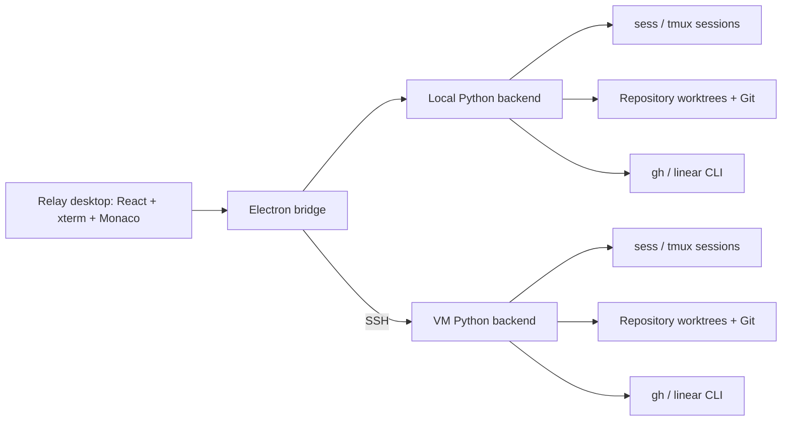

<p align="center"></p>
<h1 align="center">Relay</h1>
<p align="center">One workspace. Multiple repositories. Persistent coding agents.</p>

**macOS 12+ · Apple Silicon only.** Current downloads are ad-hoc signed and **not notarized by Apple**. Intel Mac, Windows, and Linux desktop installers are not available.

[Download](https://github.com/Magi-Labs/relay/releases) · [Architecture & CLI](docs/relay/lite-v1.md) · [Contributing](CONTRIBUTING.md) · [MIT license](LICENSE)

Relay is a terminal workspace app for coding agents. Run agents locally or on an SSH-accessible VM, give each task worktrees across several repositories, and inspect every repository’s files, diffs, Git state, pull requests, and attached Linear ticket in one window.

## Why Relay exists

Relay is a fork of [Orca](https://github.com/stablyai/orca). It was created to address the feature bloat and reliability problems we encountered in our terminal-first, multi-repository workflow. Relay retains Orca’s UI foundations and focuses the application on workspaces, terminals, files, and Git.

Phone pairing, automation dashboards, task management, account onboarding, and unrelated settings are excluded from the active application. The inherited source and Git history remain for attribution and continued reuse; this is a focused application build, not yet a minimal source tree. See [NOTICE.md](NOTICE.md) for attribution.

## Install

**Apple Silicon · macOS 12 or newer**

```sh
brew install --cask deepaksilaych/tap/relay
# Update an existing installation:
brew update && brew upgrade --cask relay
```

You can also download a DMG or ZIP from [Releases](https://github.com/Magi-Labs/relay/releases). Current builds are ad-hoc signed and strictly verified, but **not notarized by Apple**. macOS may require approval in System Settings → Privacy & Security. Automatic in-app installation remains disabled.

Homebrew installs Git, GitHub CLI, tmux, and Python for local execution. Install your coding-agent CLI separately. Remote hosts need their own tools and an SSH alias; Relay can use sess presets. Native Windows sessions and Intel Mac/Linux desktop installers are not currently supported.

## How it works

1. **Choose an execution host.** Work locally or connect to a VM through SSH. Every host has a permanent `Genral` workspace.
2. **Create a task workspace.** Select repositories and new or existing branches. Relay creates one worktree per selected repository inside the workspace folder. You can also start blank.
3. **Run agents in terminals.** Each terminal attaches to a real sess/tmux session on its host. Split panes, reorder tabs, and work across repositories from the same task context.
4. **Inspect and review.** Open files and diffs as tabs. Stage, unstage, and commit in the relevant repository. GitHub PR state comes from `gh`; Linear status comes from authenticated `linear` CLI requests.
5. **Reconnect later.** Closing the desktop app detaches its terminals while host sessions keep running. Explicitly ending a terminal stops that session. Losing SSH connectivity makes its state unknown; it does not mean the agent exited.



The execution host owns its files, Git operations, workspace manifests, and agent processes. The desktop routes requests to that host rather than keeping agent ownership in a UI tab. PR and ticket queries use a separate worker so network requests do not block terminal attachment.

### Workspace layout

Local data defaults to `~/Documents/Relay`; a VM defaults to `~/relay`:

```text
relay/
├── repos/                         # canonical clones, usually created with gh
├── workspaces/<task>/
│   ├── workspace.json             # repositories, terminals, layout, ticket
│   ├── AGENTS.md                  # instructions and attached repository paths
│   └── repos/
│       ├── frontend/              # task worktree
│       └── api/                   # task worktree
├── util_repos/                    # shared utility repositories; no worktrees
└── utils/                         # backend, agent CLI, sess state and registry
```

Existing repositories may also be registered in place. Shared utility repositories are intentionally shared. Worktrees provide working-directory isolation, not a security sandbox.

### Agent CLI

Relay installs its CLI on each configured execution host. Terminals receive the workspace context so agents can attach another repository without depending on an open desktop connection:

```sh
relay repo attach frontend --new-branch task/checkout --json
relay repo attach api --new-branch task/checkout --json
relay status --json
relay ticket attach ENG-123 --json
```

A blank workspace creates worktrees when the agent explicitly attaches repositories. Relay does not intercept arbitrary file writes; the generated `AGENTS.md` tells agents to attach before editing.

### Linear tickets

Install [schpet/linear-cli](https://github.com/schpet/linear-cli) on the execution host and authenticate there:

```sh
linear auth login
# On a headless VM without a system keyring:
linear auth login --plaintext
```

The second command stores the credential unencrypted in the CLI’s configuration file. Enter the key in the CLI prompt.

Paste a ticket ID or full Linear issue URL when creating a workspace or attaching a ticket later. Relay verifies it before saving, displays its live status and color, and refreshes while the app is visible. Invalid tickets do not replace an existing attachment or create an unwanted workspace.

## Interface

- **Left:** workspaces, host selection, filtering and reordering.
- **Top:** terminal and file tabs; nested terminal splits.
- **Right:** repository files and source control with colored status icons.
- **Bottom:** host status, repository changes, PRs and the linked Linear issue.

Sidebars and split panes resize by dragging. Selected names can be renamed by clicking again or using the context menu. Cmd-click opens HTTP/HTTPS links in the browser and existing file paths in a tab. Native terminal hyperlinks and URLs wrapped across terminal lines or parenthesized table cells open their complete targets. New terminals advertise true-color and hyperlink support, and discard color-disabling variables inherited from the app launcher; shell startup files can still override those defaults. Normal dragging selects terminal text locally, even when agents capture mouse input; Option/Alt sends mouse gestures to the application. Cmd+C copies; Ctrl+C interrupts.

## Keyboard shortcuts

Use Cmd on macOS; Ctrl on Linux.

| Shortcut         | Action                                                              |
| ---------------- | ------------------------------------------------------------------- |
| Cmd+Up / Down    | Previous / next workspace                                           |
| Cmd+Left / Right | Previous / next terminal tab                                        |
| Cmd+N            | New workspace                                                       |
| Cmd+T            | New terminal tab                                                    |
| Cmd+D            | Split the focused pane side by side                                 |
| Cmd+Shift+D      | Split the focused pane above/below                                  |
| Cmd+W            | Close the file or focused terminal pane; archive an empty workspace |

Splits can nest. Drag their dividers to resize; layouts and order survive restart. Closing an individual pane ends that session. Archiving an empty workspace retains its worktrees; Genral cannot be archived.

## Agent CLI

Relay's CLI is separate from Orca. It does not require `orca-ide` or implement Orca's orchestration protocol. For a persistent agent launch:

```sh
relay workspace list --json
relay --workspace WORKSPACE_ID terminal run --name Review --command 'codex' --json
relay --workspace WORKSPACE_ID terminal read --terminal TERMINAL_ID --json
relay --workspace WORKSPACE_ID terminal send --terminal TERMINAL_ID --input-text 'Review this change' --enter --json
```

Use `terminal run` for headless launches; `terminal new` only adds a tab. Separate calls can start concurrent terminals. See the [agent CLI skill](resources/relay/skills/relay-cli/SKILL.md) for supervision, cleanup, and capability limits.

## Development

```sh
gh repo clone DeepakSilaych/relay
cd relay
pnpm install
pnpm dev
```

Use the pnpm version pinned in `package.json`. The active entry points live in `src/main/relay`, `src/preload/relay`, and `src/renderer/src/relay`; the dependency-free host backend is `resources/relay/backend/relay.py`.

```sh
pnpm build
python3 -m unittest discover -s resources/relay/tests -v
node --test resources/relay/tests/updates.test.cjs
# Apple Silicon release, on macOS:
pnpm release:relay:mac
```

Packaging includes Relay’s compiled app, node-pty, and its host backend. Monaco loads when needed; terminal views are retained within a bounded cache when switching to files. See [the architecture guide](docs/relay/lite-v1.md) for data paths, session ownership, and test isolation, and [CONTRIBUTING.md](CONTRIBUTING.md) before changing code.

## Renamed from Relay

Relay was previously called Magi. Version 0.3.0 moves the default local data directory to `~/Documents/Relay`, the VM directory to `~/relay`, and the desktop profile to `~/Library/Application Support/relay`. Old directories become compatibility symlinks, so existing agent processes can still use their original paths. Workspace IDs and live tmux processes are preserved. New sessions use `relay-` IDs; old `magi-` IDs remain valid until those sessions end. The primary CLI is `relay`, with `RELAY_ROOT` and `RELAY_WORKSPACE`; the old CLI/environment names remain compatibility aliases.

### Files and sess 0.7.0

Drop up to eight regular files (25 MiB total) into a terminal. Local terminals receive quoted local paths. VM terminals use the bundled, checksum-verified sess 0.7.0 client to upload over SSH and insert remote paths. Relay never presses Enter. The first transfer updates the selected host's sess helper using `sess init`. Uploaded files are private, checksum-verified, and retained under `~/.local/share/sess/uploads/` until deleted.

sess 0.7.0 uses zmx for its own new sessions. Relay currently retains its tmux session adapter to preserve running agents and terminal scrolling; file uploads use the new sess client independently. Live tmux sessions cannot be converted into zmx sessions. Clipboard image pixels and folder drops are not supported.

## Project origins

Relay is independently maintained by [Deepak Silaych](https://github.com/DeepakSilaych). It derives from Orca and uses [sess](https://github.com/DeepakSilaych/sess) for persistent sessions. Original copyright notices and licenses are preserved. Relay changes are also released under the MIT license.

Releases before this repository was established remain in the [original development fork](https://github.com/DeepakSilaych/orca/releases).

### Repository browser and comparison

The **Repositories** button lists repositories registered on the selected host, with their paths, origin, branch, working-tree status and workspace attachments. Use **+** inside that view to register or clone another repository.

In **Files**, each repository has a comparison ref. `auto` tries `dev`, `origin/dev`, `main`, `origin/main`, `master`, `origin/master`, then `HEAD`. Enter another branch, tag or commit and click **Apply** to save it for that workspace. The explorer marks added, modified and deleted files, including changes already committed on the task branch. Click a changed file to see the selected ref beside its current contents; **Edit file** opens the editable working copy. Deleted paths remain in the explorer for reviewing their diffs. Source control's staging view stays separate.

Agents can set the same ref on the execution host:

```sh
relay --workspace WORKSPACE_ID repo compare REPO_NAME --ref dev --json
```

Comparisons use the selected commit directly, rather than a merge base, and include staged, unstaged and untracked files. Remote-tracking refs use the last fetched state; Relay does not fetch automatically.
